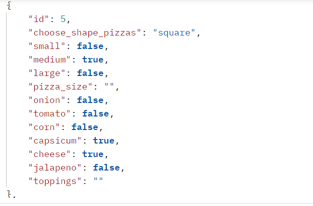

                                  **ABOUT THE PROJECT**
**API OF PIZZAS**
creating API of pizzas in django file. In this project creating APIs of the pizza there

user can add pizza details. user can edit or delete any pizza at any point of time.

we can see all the pizza details in json and API form. we can see name and shape_of_pizzas at another point of time.

****Details of how to run this project in your local system.****

1. You can make a folder there you can clone this project.
2. Now, you intialize a empty git repo by using
   git init
3.now yo can clone the repo by using https using this command
   git clone "url"
4.Now, you can install some libraries bu using this commands.
   pip install -r requirement.txt  #This command can intall all the library that you need.
5. ow you can run a command for the database.
   pyhton manage.py makemigrations
   pyhton manag.py migrate
6. You have to run commnad fo the database.

****Details of every api and their end point****

1. First api endpoint  to see all the data that present in the database.
   You can send GET request with this url.
   http://127.0.0.1:8000/pizza_choice/create/
   You can see the data you get it was just example.
    

2. Second api endpoint  to see all the data that present in the database.
   You can send GET request with this url according to this url
   http://127.0.0.1:8000/pizza_choice/<int:pk>/
   You can see the data you get it was just example.
   
    
   

3. Third api endpoint to post the data in the database.
    you can send POST request to send the data of the API with thi url
   http://127.0.0.1:8000/pizza_choice/create/
   you can post the data in this format just an example:
   {
        "choose_shape_pizzas": "pizza_size",
        "small": boolen value,
        "medium": boolen value,
        "large": boolen value,
        "pizza_size": "any other pizaa size",
        "onion": boolen value,
        "tomato": boolen value,
        "capsicum": boolen value,
        "cheese": boolen value,
        "jalapeno": boolen value,
        "toppings": "any other toppings"
    }
   you can see the post data in the Image just for an example.
   
   
4. Fourth api  endpoint to update the stored data in the database
   you can send PUT request to the data using this url according to the id
   http://127.0.0.1/pizza_choice/<int:pk>/
   you can send PUT request to the data whatever you need to update.
   {
    "choose_shape_pizzas": "square",
    "small": true
   }
   you see the data like this just an example.
   
   
5. Fifth api endpoint to delete the data from the database
    you can ssend DELETE request to the data using this url according to the id:
   http://127.0.0.1/pizza_choice/<int:pk>/
   
    you see the data you get in this image:
    
   
   ****API for the shape of the pizza only****

1. First api endpoint  to see all the data that present in the database.
   You can send GET request with this url.
   http://127.0.0.1:8000/pizza_regular/
   You can see the data you get it was just example.
   
   
2.Second api endpoint to post the data in the database.
    you can send POST request to send the data of the API with thi url
   http://127.0.0.1:8000/pizza_regular/
   you can post the data in this format just an example:
    {
    "choose_shape_pizzas": "Shape_of_pizza",
    "small": Bollen type
    }
    you see the data you get like in this image just an example:
    